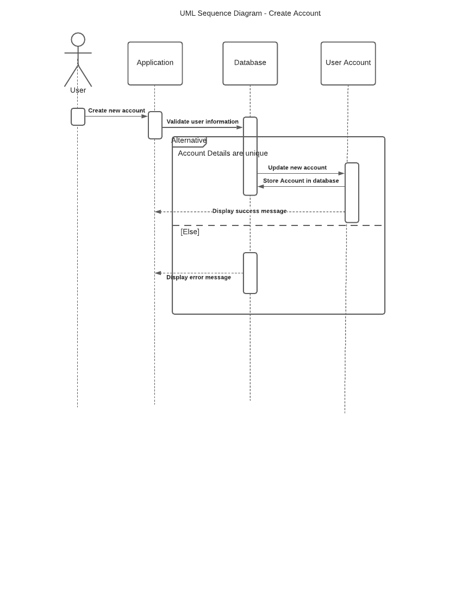
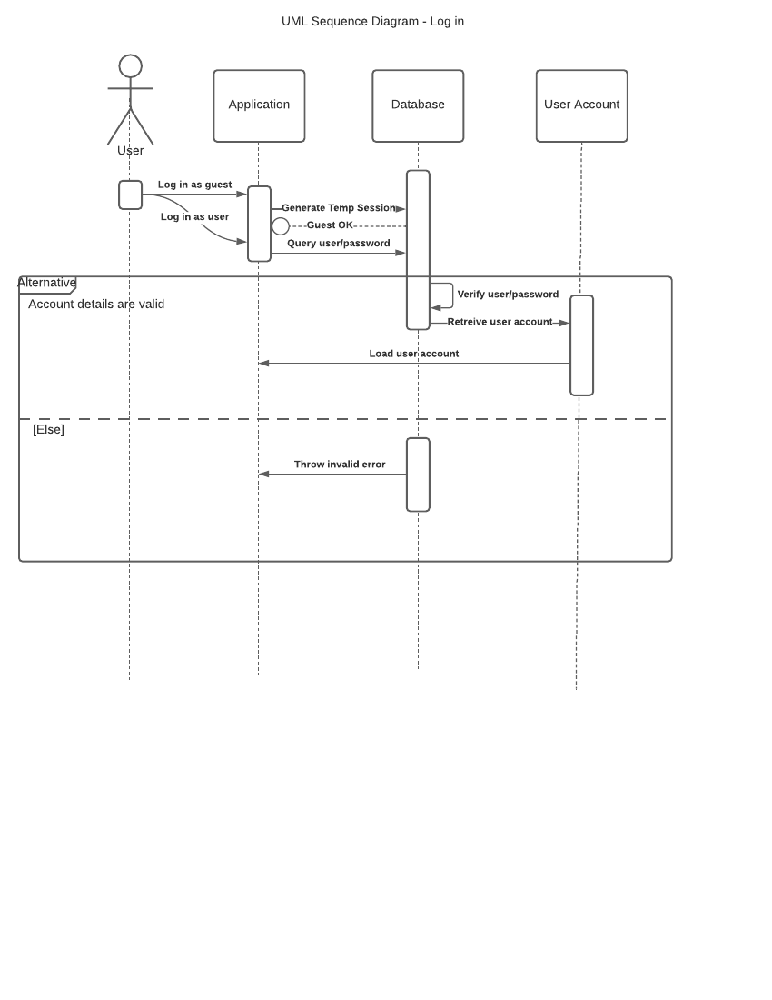
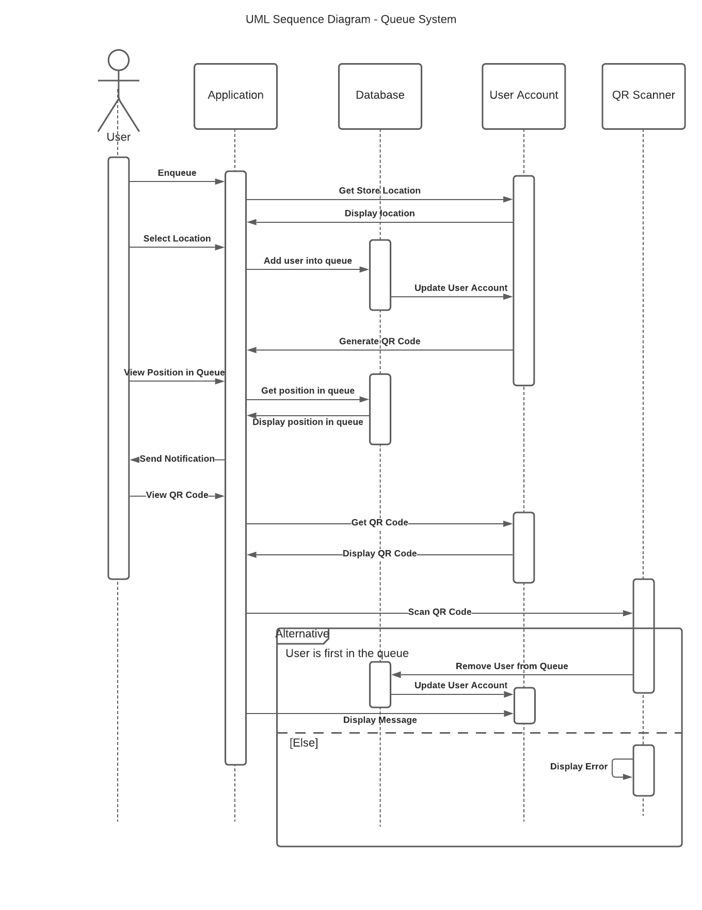
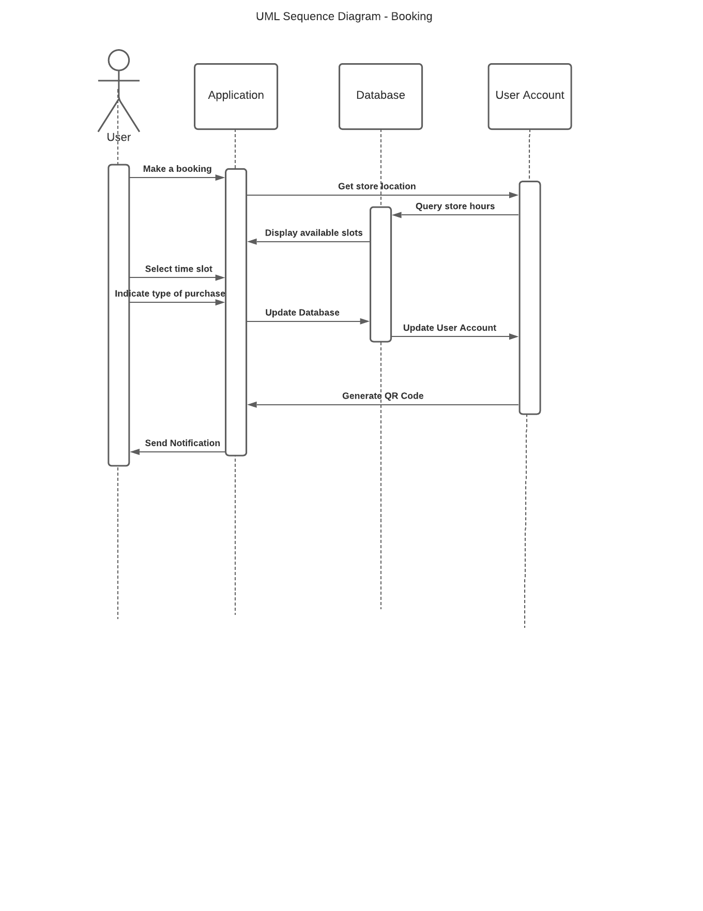
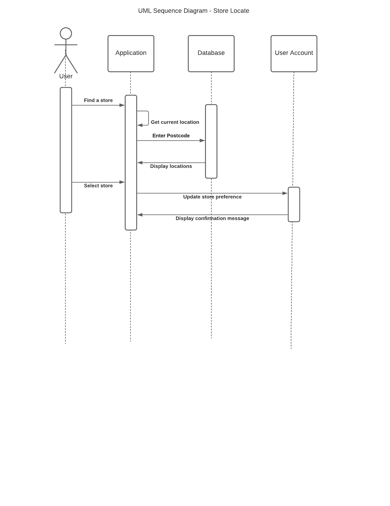
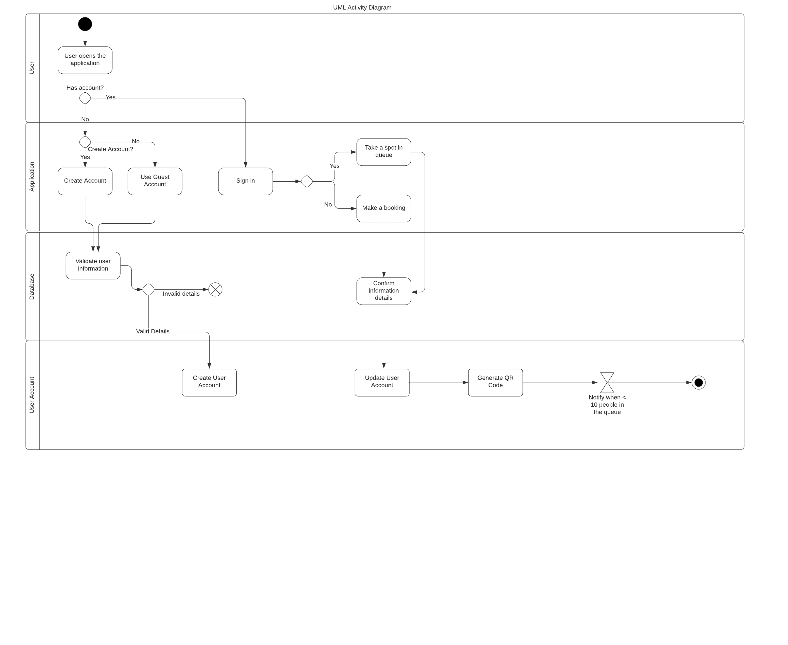

# CMPE2002 - Assignment 1 - Problem Statement 1 'Customer Lineup' Connor Kuljis 19459138
# Introduction
This document will cover; the suitable requirement elicitation techniques to 
analyze the requirements, and the relevant modeling diagrams to show aspects 
of the system. 
There are a wide variety of requirement elicitation (RE) techniques that suit 
the requirements gathering process for the “CLup: Customer Lineup” project. 
Requirements engineering often has no “right way” when designing requirements 
for a software system, and such requirements may change over time. Requirement 
elicitation methods include; introspection, background reading, hard data, 
interviews, surveys, meetings, focus groups, brainstorm/JAD, prototypes, 
ethnomethodology, participant observation and knowledge elicitation.

# Methodology
When gathering requirements, it is often important to do some background reading 
on the domain to see if there exists any similar systems within that domain. 
This may be in the form of researching related applications. Upon researching online, 
a highly relevant example is the appointment
booking website ‘HotDoc’ - https://www.hotdoc.com.au/ which allows users to book 
appointments for general practitioners around Australia. This 'hotdoc' system
overlaps with the key covid-19 related issues 'CLup' is trying to solve. Such as
incorporating a time slot booking system, mobile check-ins and 'place in queue'.
The advantage of this background reading is that it helps define business objectives
and how a similar approach could be inspired and adapted to a grocery store.

To further gather requirements I have combined introspection and brainstorming to
elicit requirements. Generally a brainstorm 
is a creative technique to rapidly 
visualise ideas of how to solve problems. By reading the problem statement an analyst 
can
come up with potential ideas and characterise topics for discussion. For example - 
who are the potential stakeholders of the product? What is the ‘problem’ that the 
project is aiming to solve? By using introspection, some potential users
of the product may be - the users themselves, employees, managers, maintanence ect.
In essence 'CLup' is a response to the covid-19 pandemic limits the number of customers in the store, 
leading to hour long queues outside the store.

## Assumptions
The application is a web and mobile based platform.
Managers may want to edit opening hours through the application.
Instead of having seperate accounts for employees, they can download the app
and create QR codes via guest.

# Reflection
One challenge encountered was eliciting the requirements for the 'fallback option', 
where physical tickets/QR codes are given out by hand. Upon review of my analysis, 
it seems that I have made an oversight and that the system does not fully support 
this 'offline' feature. For example, how will the person with the physical ticket 
be notified that there ticket has been called? A potential solution to this is to 
have a large electronic display outside the store, but this may conflict against 
the issue that the software is trying to solve. Further analyis is required. 
Furthermore as I brainstormed introspectively - my analysis is succeptable to self
bias and a lack of others opinions. Because of the absence of feedback from others
my inherit bias may have impacted the overall design.

# Conclusion
To conclude I have used brainstorming, introspection and background reading to analyse
the information to; identify key actors in the system, modelled potential use cases 
and functionality of the system, how each use case may occur in sequence and graphed 
activites in the system.

# References
RE-Requirements Elicitation, CMPE2002, Curtin University, accessed September 2020.

RE-Requirements Modeling, CMPE2002, Curtin University, accessed September 2020.

RE-Modeling System Interactions, CMPE2002, Curtin University, accessed September 2020.

RE-Modeling Activity States, CMPE2002, Curtin University, accessed September 2020.

Field of Requirements Engineering, 2004, Steve Esterbrook, draft.

https://practices.hotdoc.com.au/gp/

https://lucidchart.com

 
