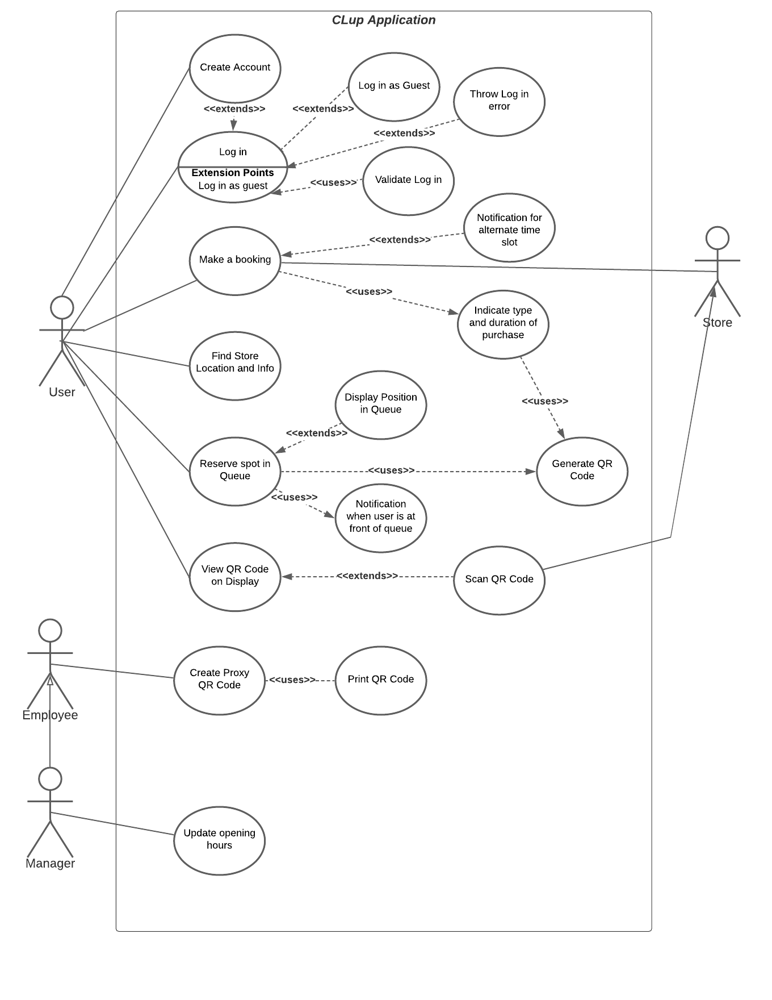

/newpage
# Report

# Introduction
Software applications can provide new solutions to problems existing in the world today.
The case study "Customer Line Up" is a project to help solve the issue of large queues that
violate coronavirus social distancing in essential businesses.


# Methodology
This document will cover; the suitable requirement elicitation techniques to 
analyze the requirements, and the relevant modeling diagrams to show aspects 
of the system. 

The components of this document include:
* A (2) page report
* Appendix A - UML Diagrams and i* Models
* Appendix B - Software Requirement Specification (SRS)
* Appendix C - Wireframe/Mockups

There are a wide variety of requirement elicitation (RE) techniques that suit 
the requirements gathering process for the “CLup: Customer Lineup” project. 
Requirements engineering often has no “right way” when designing requirements 
for a software system, and such requirements may change over time. Requirement 
elicitation methods include; introspection, background reading, hard data, 
interviews, surveys, meetings, focus groups, brainstorm/JAD, prototypes, 
ethnomethodology, participant observation and knowledge elicitation.

When gathering requirements, it is often important to do some background reading 
on the domain to see if there exists any similar systems within that domain. 
This may be in the form of researching related applications. Upon researching online, 
a highly relevant example is the appointment
booking website ‘HotDoc’ - https://www.hotdoc.com.au/ which allows users to book 
appointments for general practitioners around Australia. This 'hotdoc' system
overlaps with the key covid-19 related issues 'CLup' is trying to solve. Such as
incorporating a time slot booking system, mobile check-ins and 'place in queue'.
The advantage of this background reading is that it helps define business objectives
and how a similar approach could be inspired and adapted to a grocery store.


To further gather requirements, a common methodology is a brainstorm.
A brainstorm allows analysts to come up with potential ideas and characterise topics for discussion. For example - 
who are the potential stakeholders of the product? What is the ‘problem’ that the 
project is aiming to solve? By using introspection, some potential users
of the product may be - the users themselves, employees, managers, maintanence ect.


# Discussion Section
* difficulties
* limitations on analysis
* interesting lessons learned 
* etc

# Conclusion
* summarize
* brief assessment

# Appendix A Models

---
# Appendix B SRS
title: Software Requirements Specification for **Customer Line Up**
author: Connor Kuljis
version: 1.0
date: 2020-11-06
format: Karl E. Weigers SRS Format

---
\newpage

# 1 Introduction
# 1.1 Purpose
This document is a manual of software requirements for the "Customer Lineup" project,  assisting in managing customer queues outside essential stores.

# 1.2 Document Conventions
DB - Database
ER - Entity Relationship
JDBC - Java Database Connectivity
AWS - Amazon Web Services
EC2 - Conmpute platform for AWS
MySQL - Open source relational database management system
RDS - Relational Cloud Database Service
CI/CD - Continuous Integration / Continuous Delivery

# 1.3 Intended Audience and Reading Suggestions
This document may be useful for key stakeholders such as store managers, employees as well as customers.
This document may be useful for organisations and teams such as developers, testers, project managers, marketing and customer service.

# 1.4 Project Scope
The system is a mobile and web based platform, integrated with relational database and queue management features.
The purpose of this customer queueing software is to assist customers in finding the right store to place in-queue, reserve and book timeslots. The software is to ease store management and create engaging insights for 
store managers and employees.


# 1.5 References
```
https://d1.awsstatic.com/whitepapers/AWS_Cloud_Best_Practices.pdf
https://aws.amazon.com/rds/
https://aws.amazon.com/ec2/
https://reactnative.dev/
https://www.mysql.com/
https://docs.oracle.com/javase/tutorial/jdbc/basics/index.html
https://aws.amazon.com/compliance/iso-27018-faqs/
https://www.w3.org/standaords/webdesign/accessibility
```

# 2. Overall Perspective

# 2.1 Product Perspective
The customer queueing software contains the following information:

# Store Details
* It includes store location address and postcode, along with the available opeining hours.

# Customer Details
* It includes details such as email, name, phone number, postcode. This data is used to keep record 
of customer activity and provide notifications to customers

# Queue 
It includes deatails such as queue name, the number of users in the queue, who is at the front 
of the queue, expected wait time. Verifying members of the queue

# QR Code Generator and Booking Features
It includes information about the user account such as booking time, address ect.


# 2.2 Product Features
The product is an new and innovative system to replace existing line-up processes outside stores.
The features of the system can be seen in a UML Use Case Diagram


# 2.3 User Classes and Characteristics
# Customer
* Customers of the system should be able to find information about a store and its location. 
Customers can make bookings, which provides notification functionality and optional information about
their booking, such as the duration and type of purchase. Users can enter a queue, which updates
based on the current size of the queue and will alert the user when they are at the front of the queue.
Customers interface with the system through a qr code on their device, or printed on paper.

# Employees
* Employee user privellages allow the same sub-class features as a customer, but have higher priority features
to view information about the store, scan or create QR codes. Managers are one heirarchy up, inheriting all the features
of an employee, but being able to update store information (such as hours, opening times) and generate reports.

# 2.4 Operating Environment
Operating environment for the queueing system follows:

* Server Hosting: AWS EC2 w/ Ubuntu Linux
* Database: Amazon RDS for MySQL
* Mobile: iOS and Android
* Web: Native browser (Chrome/Firefox)
* Platform: Java + JDBC (Backend), Javascript/React(Frontend)

# 2.5 Design and Implementation Constraints
# Accessibility
Website accessibility is a concern for users of all ages and backgrounds. 
The web must be suit and provide access to people with diverse abilities.
Groups such as those with disabilities, the elderly and those with lower access to technology must be concidered.
    - Accessibility conventions can be found at *https://www.w3.org/standards/webdesign/accessibility*
    - Additionaly provide offline measures such as a QR code print functions

# Scalability and Reliability
Developers must conform to the AWS Well-Architected Framework Whitepaper where possible in the management and provisioning of servers.

# Regulation storing customer information
    - (PII) must be stored in compliance with ISO/IEC 27018:2019 Certification.

# 2.6 User Documentation
* User tutorial guide component is to be placed on the website which users can visit through a link.
* Store managers can liase with product managers/developers on how to get started with the system.

# 2.7 Assumptions and Dependencies

# 3. System Features

# 3.1 Create Account
* Description: Customer and Employee Account creation. Medium priority.
* Stimulus/Response Sequences: User opens the application and selects "Create new account" option.
* Functional Requirement:
    - REQ-01: User should be able to create an account
    - REQ-02: User information should be validated via database calls

# 3.2 Log-in 
* Description: Customer and Employee Account log-in. Medium priority.
* Stimulus/Response Sequences: User logs in as user OR guest
* Functional Requirement:
    - REQ-03: Users can sign in as guest
    - REQ-04: Users can log into a valid user account

# 3.3 Queue Functionality
* Description: 
* Stimulus/Response Sequences: 
* Functional Requirement:

# 3.4 Booking System
* Description: 
* Stimulus/Response Sequences: 
* Functional Requirement:

# 3.5 Store Location
* Description: 
* Stimulus/Response Sequences: 
* Functional Requirement:

# 3.6 QR Code Generation
* Description: 
* Stimulus/Response Sequences: 
* Functional Requirement:

# 4. External Interface Requirements

# 4.1 User Interfaces
* Web Front-end software: Javascript using React framework.
* iOS and Android Front-end software: React Native Modile App framework.

# 4.2 Hardware Interfaces
Hardware interfaces in which the system will interact with:
* Various iOS and Android Smartphones, notabily cameras.
* Browsers that supports HTML and Javascript.

# 4.3 Software Interfaces
The software will interface with a wide variety of devices.
* Responsive Design

# 4.4 Communication Interfaces
* Public network required to connect to Amazon servers (LAN/WAN).

# 5 Other Nonfunctional Requirements

# 5.1 Performance Requiremeonts
# Queue Response Time
    - Queue real time system should not be delayed more than 30 seconds.
# Queue Throughput
    - Queue real time tracking must handle 500 customers per store .
# Notification Response Time
    - Notifications must not be delayed by more than 30 seconds.
# Application Reliability
    - Application must be available 99.5% of the year.

# 5.2 Safety Requirements
    - Database secrets/credentials must be stored securely.
    - Backups of the database are to be stored in deep storage. Must handle complete failure/ loss of data.
    - Access/Changes to the database and software must be documented in the form of logs.
    - Encryption should be enforced where possible (End to End Encryption/ SSL).

# 5.3 Security Requirements

# Privacy Regulation
    - Customer information/personally identifiable information (PII) must be stored in compliance with ISO/IEC 27018:2019 Certification.
# Security
    - Control Systems for access to cloud resources must be enforced by access policies.

# 5.4 Software Quality Attributes
    - Scalability: system must increase or decrease resouces to meet demand.
    - Flexibility and Testability: system must be able to roll back to previous version as a failsafe (CI/CD).

# 6. Other 

# Appendix C Wireframe/Mockups


